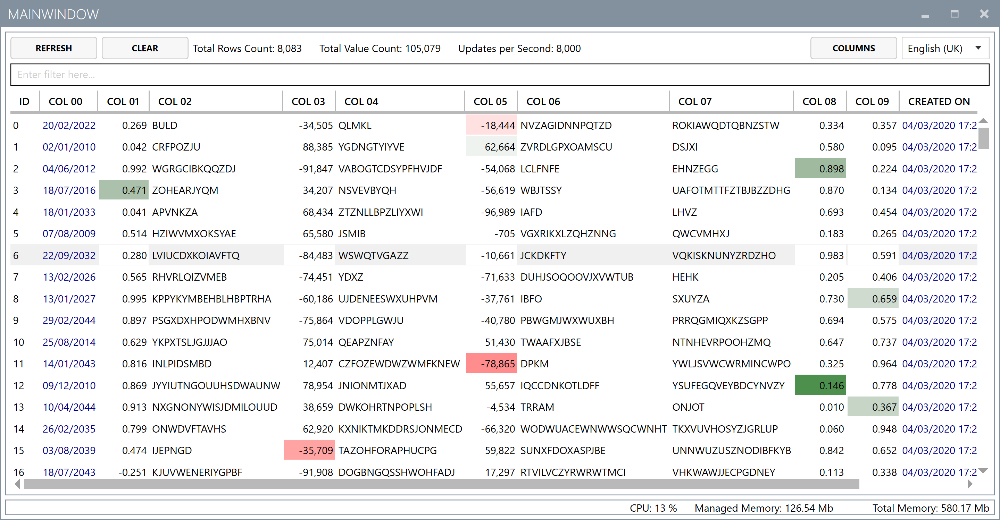

# Simple.Wpf.DataGrid

As with all my 'important' stuff it builds using the amazing [AppVeyor](https://ci.appveyor.com/project/oriches/simple-wpf-datagrid).

The app is skinned using [Mah Apps](http://mahapps.com/).

As with my other projects this is *opinionated software* on the way to build a modern UI in WPF, this example is around a dynamically updating data grid (blotter). It's built without using an third party libraries for the data grid, not because I don't think they do the job required, but because I wanted to see want could be done without any. For me the thrid party libraries have their place, they provide UI's around filtering, sorting, grouping etc out of the box.

The screenshot gives an example of the app running, would i ever load 8000 rows into a real-world app, hopefully not, but some clients insist on all the data even though they can't possibly comprenhend so much data in one go :)

The UI's built using MVVM as the MVC architecture and being 'pure' about the separation between the View & View Model etc. The UI renders the data provided by a mock backend service, 'TabularDataService'. The size of the data is dynamic, that is the number of columns & rows is determined at runtime, this means the structure of a row of data is not know at compile time and therefore it does not use a predefined View Model or Model (for the structure of the data). The backend service uses Reactive Extensions to stream not only the initial snapshot of data but updates to the data generated every 100 ms, this is shown below by the cells with coloured backgrounds, these use an animation to fade away over a 0.5 second period.

Happy coding...

